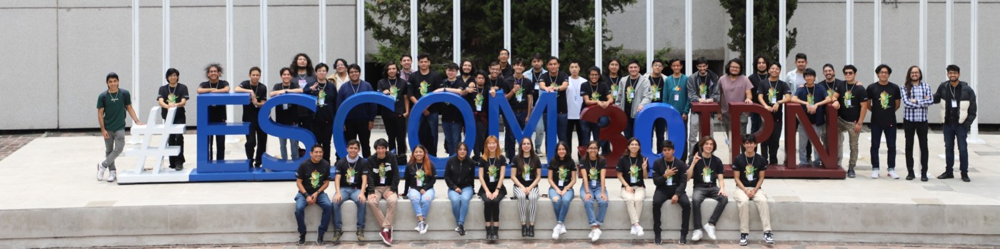

  

  <h1 style="color: #007acc; font-size: 2.5em; margin: 20px 0; text-shadow: 2px 2px 4px rgba(0,0,0,0.1);">
    Hi, I'm Jesús Manuel 👋
  </h1>
  
  

    <h3 style="color: white; margin: 0; font-size: 1.3em; line-height: 1.6;">
      A data scientist passionate about teaching and programming, with experience in data analysis, automation, and generative AI agents.
    </h3>
  

  

  

  <h3 style="color: white; margin: 0 0 20px 0; font-size: 1.5em; text-align: center;">Connect with me:</h3>
  

    
    
    
    
  

  <h3 style="color: white; margin: 0 0 20px 0; font-size: 1.5em; text-align: center;">Languages and Tools:</h3>
  

     
     
     
     
     
     
     
     
     
     
     
     
     
     
     
     
     
  

  

    
  

