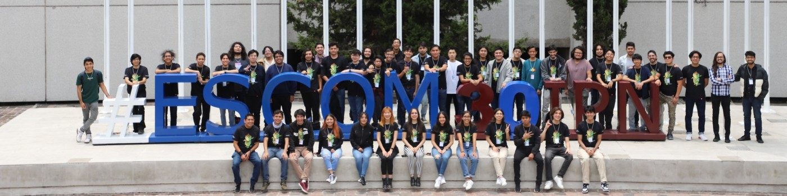

  

  <h1>Hi, I'm Jesús Manuel</h1>
  
Data scientist & AI engineer from Mexico City. I build multi-agent systems, data pipelines, and LLM-powered products — and make data science education accessible.

---

  <h3>Connect with me:</h3>
     

---

## Tech Stack

---

## Currently Working On

| Project | Description |
|---|---|
| **[VNP46A1 Satellite Processing](https://jmlopezfabian.github.io/Procesamiento-de-Imagenes-Satelitales-VNP46A1/)** | Async pipeline processing NASA nightlight imagery to extract nocturnal luminosity metrics aggregated by municipality |
| **Satellite Dashboard** | Dashboard for interactive visualization of satellite imagery data with GPU-accelerated charts |
| **Social Network Analysis** | Graph-based analysis of character relationships and interaction patterns across a media franchise |
| **Tukey Lab** | Educational hub for data science with guided lessons, visualizations, and real-world datasets |

---
